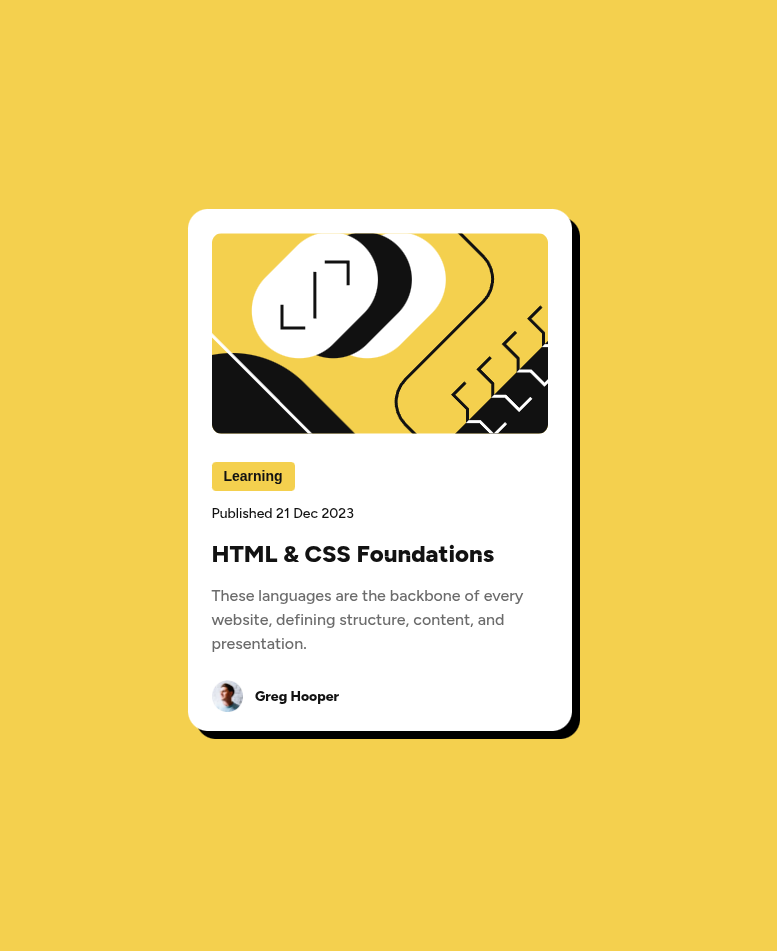

# Frontend Mentor - Blog preview card solution

This is a solution to
the [Blog preview card challenge on Frontend Mentor](https://www.frontendmentor.io/challenges/blog-preview-card-ckPaj01IcS).
Frontend Mentor challenges help you improve your coding skills by building
realistic projects.

## Table of contents

- [Overview](#overview)
    - [The challenge](#the-challenge)
    - [Screenshot](#screenshot)
    - [Links](#links)
- [My process](#my-process)
    - [Built with](#built-with)
    - [What I learned](#what-i-learned)
    - [Continued development](#continued-development)
    - [Useful resources](#useful-resources)
- [Author](#author)
- [Acknowledgments](#acknowledgments)

## Overview

### The challenge

Users should be able to:

- See hover and focus states for all interactive elements on the page

### Screenshot

+

### Links

- Solution URL: [GitHub](https://github.com/ryanwells-rwc/blog-preview-card)
- Live Site URL: [Netlify](https://blog-preview-card-rwc.netlify.app)

## My process

### Built with

- CSS custom properties
- Flexbox

### What I learned

I learned to use the clamp() CSS function to make the text on the card and
the size of the card responsive. I also learned how to use CSS custom properties
to make the card's background color and text color more easily adjustable.
Used CSS flexbox to aid in positioning the elements.

```css
.card {
	width: clamp(20.4375rem, 19.183098591549296rem + 5.352112676056338vw, 24rem);
	height: clamp(31.3125rem, 30.850352112676056rem + 1.9718309859154928vw, 32.625rem);
	border-radius: 20px;
	background-color: var(--c-white);
	box-shadow: 8px 8px 0 #000;
	padding: 24px;

	&:hover {
		box-shadow: 16px 16px 0 #000;
	}
}
```

### Continued development

I plan to learn more about using CSS flexbox and grid. I'd also like to
learn more about the math behind the clamp() function.

### Useful resources

- [Fluid Typography Calculator](https://royalfig.github.io/fluid-typography-calculator/)
  An excellent tool to help set up clamp() calls.
- [Zero to Mastery](https://academy.zerotomastery.io/) Great resource for 
  learning HTML, CSS, and JavaScript.

## Author

- Website - [Ryan Wells](https://ryanwells.io)
- Frontend
  Mentor - [@ryanwells-rwc](https://www.frontendmentor.io/profile/ryanwells-rwc)

## Acknowledgments

Thanks to [Jacinto Wong](https://github.com/JacintoDesign) for providing 
in-depth courses on CSS and Flexbox.